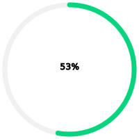

# svg-progress

[](https://www.npmjs.com/package/svg-progress)
[](https://github.com/sdyk-jym/svg-progress/blob/master/LICENSE)
>使用SVG生成圆环进度条
# Install
```bash
npm i svg-progress -S
```
# Quick Start
```javascript
import SvgProgress from 'svg-progress'

const svgProgress = new SvgProgress()

svgProgress.percent = 30
svgProgress.update()
```
# Parameter
```javascript
new SvgProgress({
    element: 'body' // 节点，使用document.querySelector
    percent: 20 // 百分比
    width: 200 // svg宽
    height: 200 // svg长
    strokeWidth: 7 // 圆环边框宽度
    r: 50 // 半径：如果没有传入，则通过计算长宽的大小计算最大半径
    rotate: 'rotate(-90, 0, 0)' // 进度起点，默认12点钟
    color: '#05d57f' // 进度颜色
    bgColor: '#f1f1f1' // 进度背景色
})
```
# Example

